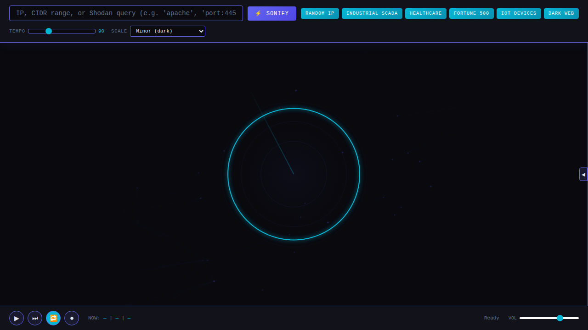

# 🎵 Sound of the Internet

**Sonify network scan data into generative music**

---

What does the internet sound like? This app converts [Shodan](https://www.shodan.io/) scan data into music. Ports become notes, protocols become instruments, CVE severity becomes distortion. Industrial SCADA networks sound like horror movie scores. Healthcare systems beep gently. Fortune 500 companies play complex jazz.

Every host is a voice. Every open port is a note. The internet is an orchestra — and most of it is out of tune.



## 🎼 Sonification Mapping

| Network Property | Musical Parameter | How It Works |
|---|---|---|
| **Port Number** → Pitch | Port 22 (SSH) maps low, port 443 (HTTPS) maps mid, port 8080 maps high. Ports are quantized to a musical scale so nothing sounds truly random. |
| **Protocol** → Timbre | HTTP gets a clean sine wave. SSH gets a saw wave (edgy). Telnet gets a square wave (retro). Industrial protocols (Modbus, DNP3) get detuned oscillators. |
| **CVE Severity** → Effects | Clean hosts sound pure. CVSS 4-6 adds chorus/wobble. CVSS 7-9 adds distortion and bit-crushing. CVSS 10 (critical) is full industrial noise. |
| **Geography** → Panning | Longitude maps to stereo position. Hosts in Asia pan left, Europe center, Americas right. Latitude subtly affects reverb depth. |
| **Organization Size** → Density | More open ports = more simultaneous notes = denser chords. A single IoT device plinks. A datacenter roars. |

## 🎧 Presets

| Preset | Description |
|---|---|
| **Industrial Nightmare** | SCADA/ICS systems exposed to the internet. Modbus, DNP3, BACnet protocols. Sounds like a horror movie soundtrack — droning, dissonant, deeply unsettling. |
| **Healthcare Hum** | DICOM servers, HL7 interfaces, medical devices. Gentle beeping, soft sine waves, periodic monitor-like pulses. Eerily calm. |
| **Corporate Jazz** | Fortune 500 companies with dozens of services. Complex chord voicings, walking basslines from sequential port scans, sophisticated and busy. |
| **IoT Lullaby** | Consumer IoT devices: cameras, printers, smart home hubs. Simple melodies, music-box timbre, occasionally interrupted by the harsh buzz of an unpatched device. |
| **Webcam Blues** | Open webcams and RTSP streams around the world. Slow, melancholic, bluesy — a slide guitar tone that drifts across the stereo field. |
| **Random Scan** | Enter any Shodan query and hear what it sounds like. Surprise yourself. |

## 🚀 Quick Start

1. Open `index.html` in your browser
2. Click a preset (or enter a custom Shodan query)
3. Listen 🎶

For live Shodan data, start the backend:
```bash
pip install -r requirements.txt
export SHODAN_API_KEY=your_key_here
python server.py
```

Without an API key, the app uses simulated network data — still sounds great.

## 🏗 Architecture

```
┌─────────────────────────────────────┐
│           Browser (Client)          │
│                                     │
│  ┌───────────┐   ┌───────────────┐  │
│  │ Web Audio  │   │    Canvas     │  │
│  │ API Synth  │   │  Visualizer  │  │
│  └─────┬─────┘   └───────┬───────┘  │
│        │                  │          │
│  ┌─────┴──────────────────┴───────┐  │
│  │      Sonification Engine       │  │
│  │  port→pitch, protocol→timbre   │  │
│  │  CVE→fx, geo→pan              │  │
│  └─────────────┬─────────────────┘  │
└────────────────┼─────────────────────┘
                 │ fetch /api/shodan
┌────────────────┼─────────────────────┐
│  Flask Server  │  (port 5003)        │
│  ┌─────────────┴─────────────────┐   │
│  │  Shodan API Proxy + Cache     │   │
│  └───────────────────────────────┘   │
└──────────────────────────────────────┘
```

- **Synthesis**: All audio is generated in real-time using the Web Audio API — oscillators, filters, effects chains. No audio files are loaded or streamed.
- **Visualization**: Canvas-based network topology that pulses and glows with the music.
- **Backend**: Lightweight Flask server that proxies Shodan queries and formats host data.

## 🧩 Part of the Creative Suite

**Project 5 of 5 — THE FINALE** 🎆

The culmination of the Creative Suite. Where data meets art meets sound. If the other projects showed you the internet, this one lets you *hear* it.

## 📄 License

MIT — see [LICENSE](LICENSE)

Built by **QuietRiverTech**
